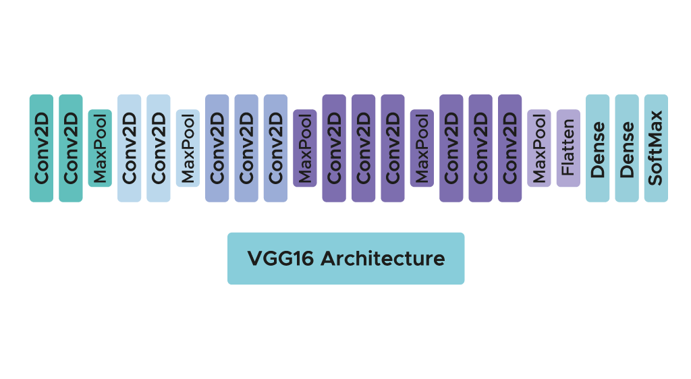
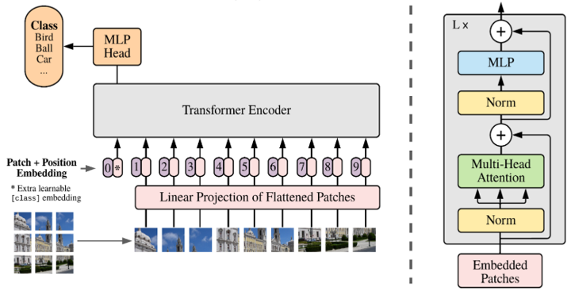
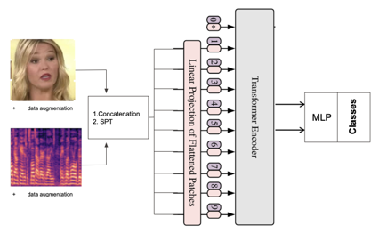
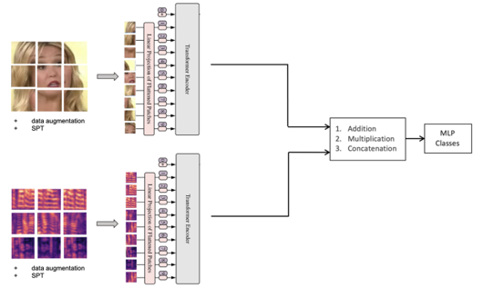
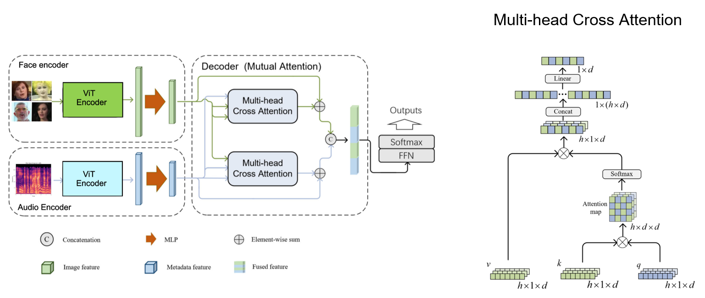
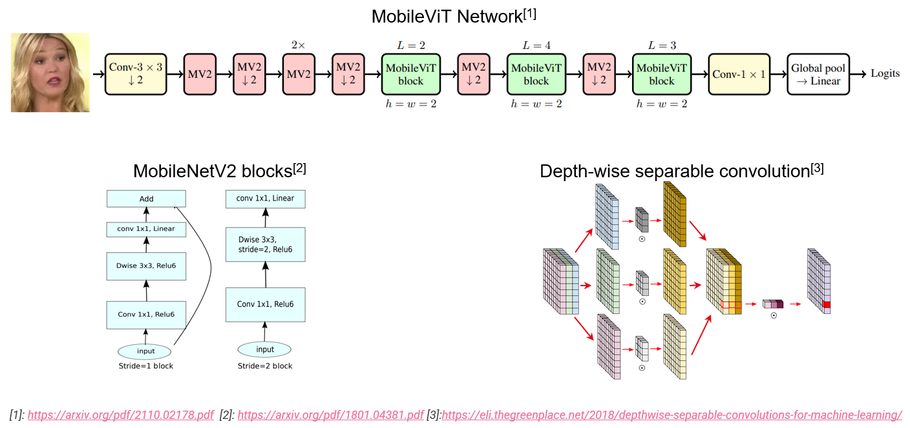
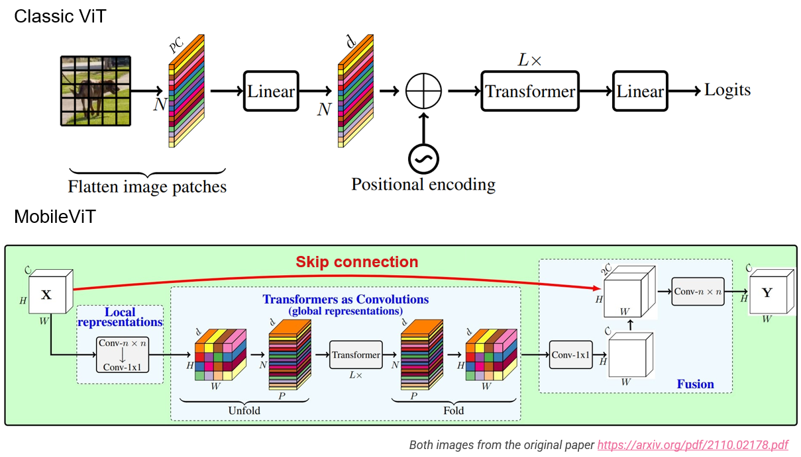

# Faces and Voices match

This repository contains the notebooks used to complete a face and voice match classification task.
Given a short audio file of a person speaking as well as a picture of the face, the task is to classify it to the correct person.

The project is exploring four disctints ways to acomplish this task:
1. Using two VGG pretrained on ImageNet. Then, one model is finetuned on the face pictures and the other using melspectrogram of the audio files. Each network can be used individually to perform classification, but wheh using them together the classification performance is increased.
2. The second approach is using a transformer architecture, specifically ViT, to perform classification. As for the VGG network, two ViTs are trained independantly before being use in an ensemble model way.
3. The logical improvement of point 2. is to trained an model which fuses the melspectrogram and face images during training. This is achieved by using a cross-attention module to mix the ViTs informations 
4. Finally, the last model tested is using two MobileViT networks used in an ensemble manner.

### <b>Accuracies of the various models </b>:
|   | Only melspectrograms | Only Faces | Ensemble | Fused |
|---|---|---|---|---|
| VGG Train | 100.0 | 100.0 | - | - |
| VGG Test | 54.21 | 79.15 | - | - |
| ViT Train | 60.70 | 94.56 | 95.75 | 99.68 |
| ViT Test | 47.89 | 81.47 | 88.21 | 91.37 |
| ViT Cross-Attention Train | - | - | - | 97.30 |
| ViT Cross-Attention Test| - | - | - | 89.16 |
| mobileViT Train | 99.000 | 100.0 | 100.0 | - |
| mobileViT Test | 80.0 | 91.47 | 94.63 | - |

 

An additional task for this project was to optimise a metric taking into account number of parameters possible. Hence all networks have been compared on their number of parameters:

| VGG | ViT | ViT fused Cross-Attention | mobileViT |
|---|---|---|---|
| 44.3M for two network | 51.8M for two networks | 30M for a single network | 2.7M for two networks |
 

Finally, much more other tests have been done, using ResNet networks, different fusion strategy for the ViT models. However, as the results where not concluant, the code are not provided here.

 

## 1. VGG architecture
The first netwowk is a simple convolutional network as shown in the following figure.  
As it contains loads of parameters, weights trained on ImageNet are used as a pretraining. Hence, only the last dense layer are finetuned using the face images and melspectrogram.   

 

When using VGG16, the models shows important overfitting on the training data. Indeed, when looking at the accuracy curves between training and testing, a huge difference is visible.  

  In order to try and reduce the over-fitting, the audio files are augmented using a small time-shift before transforming them to melspectrogram.
When looking at the results with those, the overfit is slightly reduce but still problematic. 

## 2. ViT

The second approach is using a transformer architecture has it been shown to perform well on image classification tasks. Among the pioneer in computer vision transformer, ViT is a very good architecture. Its detailes architecture is shown in the following figure.

### Fusion 
In order to boost the classification performances, two networks can be fused and used in parallel. This can be done either after having trained both network independently or have two networks fused during training. 
The following fusion approach have been tesed: 
1. Concatenating the face with the melspectrogram to a single WxHx4 matrix and use it as input of a single ViT. Note that a shift patch tokenisation has been added as well. This leads to very limited performances in comparison to other methods but does not suffer from over-fitting.

2. Train two separate networks, fuse their output, either with addition, multiplication or concatenation, and use this _new_ input to train a final MLP layer. This leads to very good results even though some overfitting is visible.

3. Have two separate networks whose outputs are fuse either with addition, multiplication or concatenation and fed to a final MLP but this time training the whole system at once. This leads to almost no over-fitting but overall worst results.

However, all fusion in latent space or input image leads to worst results than output fusion, using addition.

## 3. ViT using Cross-Attention for fusion
This method is quite similar to the previsouly explained fusion concept but uses cross-attention to fuse both ViT _output_ before being used in a Feed-Forward Network. 

## 4. mobileViT
The last method tested is using a rather new transformer architecture designed to have a very low number of parameters thanks to depth-wise convolution which greatly reduces the number of parameters. In addition, the model is using a modified ViT which is having extra convolution layers as well as a skip connection. Finally, the model is using mobileNetV2 block used to encode the images as well as reduce the input size.

